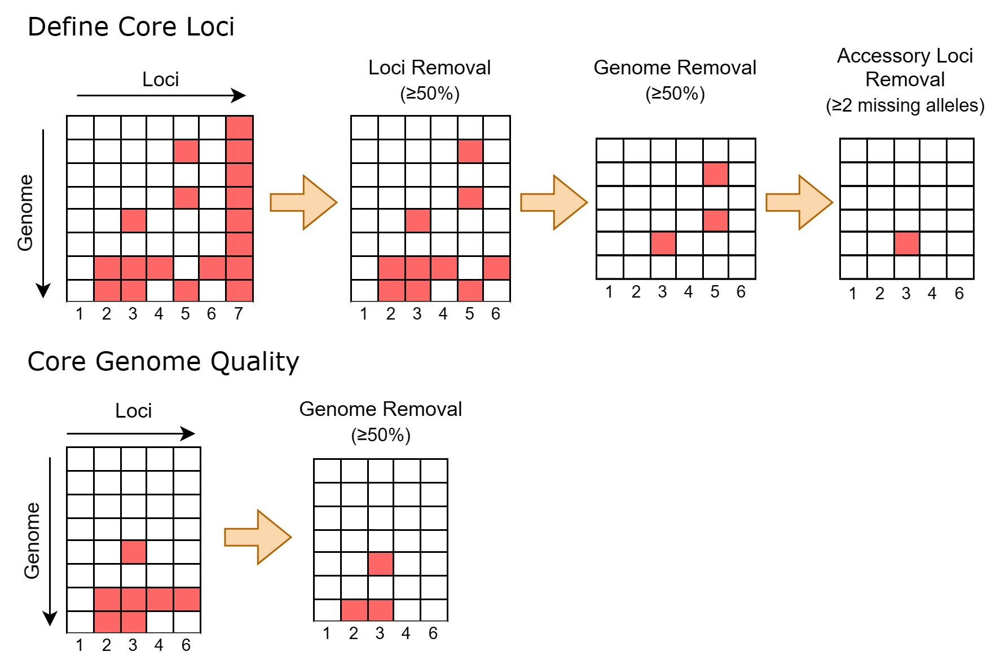

# Background

The primary objective of the Module 5 lab will be to provide a practical
overview of core genome multilocus sequencing typing (cgMLST), a
genome-based typing method widely adopted in bacterial genomic
surveillance networks across the globe. The widespread adoption of
cgMLST is due in large part to the recent advances in high-throughput
sequencing, which have enabled the routine adoption of whole genome
sequencing (WGS) in microbial surveillance. With WGS becoming
increasingly accessible, part of the cascading effect was the
development of efficient computational algorithms that further expedited
the establishment of multilocus sequence typing at genome scales as
routine practice.

The implementation of cgMLST by the PulseNet International network for
foodborne outbreak surveillance has made it possible for WGS data to be
used as evidence in public health investigations. Here, you will work
with cgMLST data to conduct a retrospective analysis on a dataset that
includes a number of possible Salmonella enterica outbreaks. Salmonella,
which is primarily transmitted to humans through the consumption of
contaminated foods, is one of the leading enteric pathogens in Canada
and across the globe and was the first pathogen for which comprehensive
genomic surveillance was implemented in Canada.

The outbreak dataset consists of WGS data from isolates recovered from
samples collected from a diverse range of geographical regions,
environments, and timelines that can be dated back to the early 2000s.
Curating this outbreak dataset involved querying a global bacterial
genomic surveillance database (GenomeTrakr) and PubMed queries to
identify peer-reviewed publications that reported retrospective genomic
analysis of Salmonella outbreaks. In this exercise, you will use a
custom workflow written in the R language for statistical computing that
includes modules to perform various steps in genomic epidemiologic
analysis using cgMLST data. Your challenge will be to leverage the tools
and data at your disposal to establish high quality cgMLST profiles that
can be used to infer genetic relatedness and to explore patterns in the
data in order to synthesize possible interpretations based on all
available genomic and epidemiological data.

To start, you are provided with pre-computed cgMLST allele calls
generated by chewBBACA ([Silva et
al. 2018](https://pubmed.ncbi.nlm.nih.gov/29543149/), using a Salmonella
core genome scheme based on 3,000 loci downloaded from
[here](https://zenodo.org/record/4724927). Minor filtering has been
performed to remove loci with zero informative alleles across the entire
dataset. The following code template was used to call chewBBACA on a set
of Salmonella genomes consolidated in a single directory called
`/path/to/my_genomes`:

    chewBBACA.py AlleleCall -i /path/to/my_genomes/ -g /path/to/cgMLST_scheme/ -o /path/to/results

## Learning Objectives

-   Understanding the significance of metrics used for MLST-based
    quality control
-   Explaining the difference between core, accessory and pan-genome
    loci and their use in MLST analysis
-   Building dendrograms from MLST data
-   Familiarisation with the ggtree R library for tree visualization
-   Exploring the clonality of bacterial populations in the context of
    bacterial foodborne outbreaks
-   Leveraging epidemiological data by linking it to MLST-based
    dendrograms to explain molecular differences and infer possible
    outbreak scenarios

## Analysis Dataset

The dataset for Module 5 lab has been uploaded to Google Sheets:

1.  [Metadata](https://docs.google.com/spreadsheets/d/12gvH6U5pwj8QK-Ui3lOIYOm_X-69A2IE0cbctaEzY5E/edit?usp=sharing#gid=1448009352)
2.  [cgMLST
    data](https://docs.google.com/spreadsheets/d/12gvH6U5pwj8QK-Ui3lOIYOm_X-69A2IE0cbctaEzY5E/edit?usp=sharing#gid=8240612)

# Getting Started

Let’s begin by loading all R packages and helper scripts required to run
all the code in this lab.

> <u>Every time you begin a new R session, you must reload all the
> packages and scripts!</u>

    suppressPackageStartupMessages(library(tidyverse))
    suppressPackageStartupMessages(library(data.table))
    suppressPackageStartupMessages(library(treedataverse))
    suppressPackageStartupMessages(library(plotly))
    suppressPackageStartupMessages(library(ggnewscale))
    suppressPackageStartupMessages(library(ComplexHeatmap))
    suppressPackageStartupMessages(library(circlize))
    suppressPackageStartupMessages(library(randomcoloR))
    suppressPackageStartupMessages(library(RColorBrewer))
    suppressPackageStartupMessages(library(phangorn))
    suppressPackageStartupMessages(library(knitr))
    source("src/mlst_helper.R")
    source("src/ggtree_helper.R")
    source("src/cluster_helper.R")

Next, read the cgMLST data and metadata into memory using `fread()` from
the `data.table` package.

    # data paths
    metadata_path <- "data/senterica_metadata_final.tsv"
    cgmlst_path <- "data/senterica_cgMLST_full.tsv"
    # read file
    meta <- fread(metadata_path, sep = "\t", colClasses = "character")
    cgmlst <- fread(cgmlst_path, sep = "\t")

# cgMLST QC

Before proceeding any further, you will first evaluate cgMLST data
quality. A number of quality criteria will be defined to determine
whether the properties of the allele profiles meet quality standards.
Incomplete genome assembly and reference bias during MLST scheme
construction can introduce significant levels of missing information in
MLST data in the form of unassigned alleles at various loci. Hence, care
must be taken to avoid comparisons that include loci and genomes with
excessive numbers of unassigned alleles that could reduce the precision
of genetic similarity calculations to be used for generating dendrograms
for inferring relationships between the various genomes in the dataset.

Below, you will conduct a series of steps to compute the frequency of
unassigned alleles across each locus (i.e. columns) and genome
(i.e. rows), which will inform the identification of poor quality
loci/genomes that may need to be flagged for removal from downstream
analyses.

> <u>Editable parts of the code have been highlighted in the code
> chunks.</u> You are highly encouraged to adjust them to observe how
> different parameters affect the outcome.

## Locus Quality

    # use compute_lc helper function to compute 
    # allele assignment rate (completeness) 
    # across all loci
    loci_completeness <- compute_lc(cgmlst)
    # write to file
    write.table(loci_completeness, "cgmlst_loci_quality.stats.tsv",
                quote = F, row.names = F, sep = "\t")
    # print summary statistics for locus completeness
    summary(loci_completeness)

    ##### EDITABLE VARIABLE #####
    lqual_threshold <- 2
    #############################

    # identify low qual loci
    lqual_loci <- loci_completeness %>% 
      filter(missing_alleles > lqual_threshold) %>% 
      pull(locus)
    # remove low qual loci from input cgMLST data
    cgmlst_lc <- cgmlst %>% select(-all_of(lqual_loci))
    # write to file
    write.table(cgmlst_lc, "cgmlst_lqual_loci_rm.tsv",
                quote = F, row.names = F, sep = "\t")
    # print filtering results
    message(paste("Number of loci before filter:", ncol(cgmlst)-1))

    ## Number of loci before filter: 2952

    message(paste("Number of loci after filter:", ncol(cgmlst_lc)-1))

    ## Number of loci after filter: 2728

    message(paste("Number of loci removed:", ncol(cgmlst)-ncol(cgmlst_lc)))

    ## Number of loci removed: 224

    message(paste0("Loci with ", lqual_threshold, " or less missing allele(s) were retained"))

    ## Loci with 2 or less missing allele(s) were retained

## Defining Core Genes

    ##### EDITABLE VARIABLE #####
    core_threshold <- 1
    genome_qual <- 25
    #############################

    # compute core loci
    core_loci <- calculate_core(
      mlst = cgmlst_lc,
      core_threshold = core_threshold,
      genome_qual = genome_qual
    )

    ## Number of loci before filter: 2728

    ## Number of loci after filter: 2668

    ## Number of accessory loci found: 60

    ## Core gene definition: less than or equal to 1 missing allele(s)

## Genome Quality

    # compute genome completeness
    # given quality filtered scheme
    genome_completeness <- cgmlst_lc %>% 
      select(1, all_of(core_loci)) %>% 
      compute_gc()
    # write to file
    write.table(genome_completeness, "cgmlst_genome_qual.stats.tsv",
                quote = F, row.names = F, sep = "\t")
    # print data summary of genome completeness
    summary(genome_completeness)

    ##### EDITABLE VARIABLE #####
    lqual_g_threshold <- 25
    #############################

    # identify low qual genomes
    lqual_genomes <- genome_completeness %>% 
      filter(missing_alleles > lqual_g_threshold) %>% 
      pull(ID)
    # remove low qual genomes from quality filtered cgmlst
    cgmlst_final <- cgmlst_lc %>% 
      filter(!(`#Name` %in% lqual_genomes)) %>% 
      select(1, all_of(core_loci))
    # remove low qual genomes from metadata
    metadata <- meta %>% filter(!(ID %in% lqual_genomes))
    # write to file
    write.table(cgmlst_final, "cgmlst_final.tsv",
                quote = F, row.names = F, sep = "\t")
    # print filtering results
    message(paste("Number of genomes before filter:", nrow(cgmlst_lc)))

    ## Number of genomes before filter: 182

    message(paste("Number of genomes after filter:", nrow(cgmlst_final)))

    ## Number of genomes after filter: 172

    message(paste("Number of genomes removed:", nrow(cgmlst_lc)-nrow(cgmlst_final)))

    ## Number of genomes removed: 10

    message(paste0("Genomes with ", lqual_g_threshold, " or less missing alleles were retained"))

    ## Genomes with 25 or less missing alleles were retained

# Hamming Distance

Distance-based and character-based methods can both be used to construct
dendrograms from cgMLST data. However, the scope of this lab will only
cover distance-based dendrograms, as character-based methods are covered
extensively in other modules. In phylogenetic analysis, distance-based
approaches are rather flexible in the sense that they can be constructed
from any measure that quantifies genetic similarity, including distances
computed by alignment-free (e.g. Mash) or alignment-based (e.g. BLAST)
similarity search algorithms. Below, you are introduced to a metric
called “Hamming distance”, which is based on computing the number of
differences between a pair of character vectors.

Given two character vectors of equal lengths, hamming distance is the
total number of positions in which the two vectors are <u>different:</u>

Profile A: `[ 0 , 2 , 0 , 5 , 5 , 0 , 0 , 0 , 0 ]`

Profile B: `[ 0 , 1 , 0 , 4 , 3 , 0 , 0 , 0 , 0 ]`

  A != B: `[ 0 , 1 , 0 , 1 , 1 , 0 , 0 , 0 , 0 ]`

Hamming distance = sum( A != B ) = 3

    dist_mat <- cgmlst_final %>% 
      column_to_rownames("#Name") %>% 
      t() %>% 
      hamming()
    # print matrix dimension
    # the dimension should be symmetric!
    dim(dist_mat)

In the context of two cgMLST profiles, hamming distance can be
calculated based on the number of allele differences across all loci.
Hamming distances will be computed in an all vs all fashion to generate
a pairwise distance matrix that will serve as the input for
distance-based tree-building algorithms such as UPGMA and
Neighbour-joining. We will visualize the clustering patterns in the
distance matrix using the ComplexHeatmap package. We will also overlay
serovar information to examine inter- and intra-serovar distances.

    # create column annotations for heatmap
    # to display serovar information
    heatmap_annot <- metadata$serovar
    names(heatmap_annot) <- metadata$ID
    heatmap_annot <- heatmap_annot[order(factor(names(heatmap_annot),
                                                levels = rownames(dist_mat)))]
    # create heatmap
    dist_mat %>% 
      Heatmap(
        name = "cgMLST\nDistance",
        show_row_names = F, # do not display row labels
        show_column_names = F, # do not display column labels
        # use custom color gradient
        col = colorRamp2(
          c(min(dist_mat), mean(dist_mat), max(dist_mat)),
          c("#7ece97", "#eebd32", "#f76c6a")
        ),
        # add column annotation to show serovar info
        top_annotation = HeatmapAnnotation(
          Serovar = heatmap_annot,
          col = list(
                        "Serovar" = structure(brewer.pal(length(unique(heatmap_annot)), "Set1"),
                                                                    names = unique(heatmap_annot))
          )
        )
      )

# Dendrogram Construction

Here you will construct a neighbour-joining (NJ) tree using the `nj()`
function from the ape package. Alternatively, a UPGMA tree can be
constructed by simply replacing `method = 'nj'` with `method = 'upgma'`
in the code chunk below.

To visualize the resulting dendrogram, you will interact with the R
package `ggtree`, which offers an extensive suite of functions to
manipulate, visualize, and annotate tree-like data structures. In this
section, you will be introduced to the different visual capabilities of
the `ggtree` package, and progressively update the same tree with
several layers of visual annotations based on available metadata.

## A Simple Tree Vis

To start, run the following code chunk to plot a circular tree of the
entire dataset with the tree tips colored by serovar information.

> You can assign a different metadata field to the `color_var` variable
> to update the mapping of the color aesthetics in the tree. For example
> setting `color_var = "Country"` will color the tree tips by the
> country of origin

    ##### EDITABLE VARIABLE #####
    color_var <- "serovar"
    #############################

    # set random seed
    set.seed(123)
    # determine category count
    # in the color aes variable
    n_colors <- length(unique(pull(metadata, !!sym(color_var))))
    # construct a core genome tree 
    # using nj algorithm
    cg_tree <- distance_tree(
      matrix = dist_mat,
      method = "nj"
    )
    # plot core genome tree and
    # colouring the tree tips 
    # by color_var
    cg_tree_p <- cg_tree %>% 
      ggtree(layout = "circular",
             size = 0.75) %<+% metadata +
      geom_tippoint(aes(color = !!sym(color_var)),
                    size = 2) +
      guides(color = guide_legend(override.aes = list(size = 3) ) ) +
      scale_color_manual(values = distinctColorPalette(n_colors))
    # print tree plot object
    cg_tree_p

## Clustering by Distance

Identifying clusters of genomes sharing highly similar cgMLST profiles
through the application of distance thresholds is a common practice in
genomic surveillance and epidemiological investigations. Detecting novel
clusters, comprising pathogen isolates from human clinical cases, can
signal the emergence of an outbreak requiring a public health response
and can provide important epidemiological insights on outbreak
progression. Similarly, the co-clustering of outbreak isolates with
isolates from food/environmental sources can help link the outbreak to
possible sources/reservoirs of the pathogen in order to inform
prevention and control measures.

In this section, you will generate genomic clusters from the dataset by
applying several distance cutoffs. You will then place clusters within
the dendrogram and analyze cluster memberships to spot possible
outbreaks in the dataset.

    # define clustering distance cutoffs
    dist_cutoff <- c(0, seq(5, 100, 5), seq(200, 1000, 100))
    # perform complete linkage clustering
    hclust_res <- map(dist_cutoff, function(x) {
      dist_mat %>% 
        as.dist() %>% 
        hclust(method = "complete") %>% 
        cutree(h = x) %>% 
        as.factor()
    })
    names(hclust_res) <- paste0("clust_", dist_cutoff)
    # print clustering results table
    (
      clusters <- data.frame(hclust_res) %>% 
        rownames_to_column("ID")
      )

Let’s now superimpose the clustering information on the previous tree to
examine whether the above code chunk has generated sensible cluster
assignments. Run the code chunk below to insert text labels that span
across tree tips assigned to the same clusters at <u>a specified
threshold</u>.

> You can update the `target_threshold` variable to examine how cluster
> membership changes in response to clustering distance cutoffs.

    ### EDITABLE VARIABLE ###
    target_threshold <- 500
    #########################

    # variable to subset clusters
    target_variable <- paste0("clust_", target_threshold)

    # create cluster group list object
    cluster_grp <- clusters %>% 
      select(ID, target_variable) %>%
      group_by(!!sym(target_variable)) %>% 
      {setNames(group_split(.), group_keys(.)[[1]])} %>% 
      map(~pull(., ID))
    # sequester singleton clusters
    cluster_grp <- cluster_grp[which(map_dbl(cluster_grp, ~length(.)) > 1)]

    # create serovar group list object
    serovar_grp <- metadata %>% 
      select(ID, serovar) %>% 
      split(f = as.factor(.$serovar)) %>% 
      map(~pull(., ID))

    # add cluster memberships and serovar information
    # to tree object
    cg_tree <- groupOTU(cg_tree, cluster_grp, 'Clusters')
    cg_tree <- groupOTU(cg_tree, serovar_grp, 'Serovars')

    # plot core genome tree where
    # colored blocks = clusters 
    # text annotations = serovars
    cg_tree %>% 
      ggtree(layout='circular', # tree shape
             size = 1 # branch width
      ) +
      # add colored blocks to display serovars
      geom_hilight(
        mapping = aes(
          node = node,
          fill = Serovars,
          subset = node %in% map_dbl(
            serovar_grp,
            ~getMRCA(cg_tree, .)
            )
          )
        ) +
      # add text annotations to display clusters
      geom_cladelab(
        mapping = aes(
          node = node,
          label = Clusters,
          subset = node %in% map_dbl(
            cluster_grp,
            ~getMRCA(cg_tree, .)
          )
        ),
        horizontal=T,
        angle = 'auto',
        barsize = 0.75,
        offset = 50,
        offset.text = 50,
        align = T
      ) +
      # legend parameters
      guides(fill = guide_legend(
        nrow = 9,
        override.aes = list(alpha = 0.8)
        )
      ) +
      labs(fill = "Serovar") +
      scale_fill_brewer(palette = "Paired")

## Cluster Analysis

In order to analyze the clustering patterns in the core genome tree at
greater resolutions, you will work with a number of R functions
introduced below. These functions are intended to be used in conjunction
to zoom in on specific bacterial populations in the dataset that would
empower you to explore the clonality and epidemiology of target strains.

### serovar\_subtree

The purpose of the function `serovar_subtree` is to analyze subtrees of
specific serovars. The target serovar to examine is defined by the
`serovar_name` variable. Specifying a “NULL” value to the variable will
display the entire tree.

The serovar tree can be annotated with cluster information <u>at a
specific threshold</u> in the form of tip-spanning text labels. The
cluster membership annotations are defined by the variable,
`distance_threshold`

    # NOTE: there needs to be a comma at the end of each line!
    serovar_subtree(
      tree = cg_tree,
      serovar_name = NULL, # which serovar cluster to visualize?
      distance_threshold = 25, # the dist threshold used for cluster definition?
      color_by = "serovar", # which metadata variable to color tree tips by?
      color.tiplab = T, # whether to color tip labels
      tip.size = 4, # size of tree tip point
      label_vars = c("geo_loc", "iso_date", "iso_source"), # metadata vars only
      label.offset = 80, # distance between labels and tree tips
      label.size = 5, # tree tip label text size
      legend.x = 0.23, # legend position on x axis
      legend.y = 0.9, # legend position on y axis
      legend.size = 4, # legend text size
      plot.xlim = 2300, # plot area width
      annot.offset = 3, # distance between heatmap and tree tips
      annot.textsize = 5, # heatmap x axis text label size
      annot.barsize = 0.75, # annotation bar width
      show.title = T # whether to display distance threshold
    )

    # export tree to pdf format
    ggsave("serovar_subtree.pdf", height = 30, width = 16)

### cluster\_subtree

The purpose of the function `cluster_subtree` is to analyze subtrees of
specific clusters defined at a given distance threshold. A cluster is
defined by its ID and the distance threshold used for assignment, which
are defined by the variables `cluster_name` and `distance_threshold`,
respectively. Note that you will need to utilize the `serovar_subtree`
to identify the IDs of clusters of interest.

    # NOTE: there needs to be a comma at the end of each line!
    cluster_subtree(
      tree = cg_tree,
      clusters = clusters,
      distance_threshold = 25, # the dist threshold used for cluster definition?
      cluster_name = "1", # cluster ID to visualize?
      color_by = "country", # which metadata variable to color tree tips by?
      color.tiplab = T, # whether to color tip labels
      tip.size = 3, # size of tree tip point
      legend.x = 0.1, # legend position on x axis
      legend.y = 0.85, # legend position on y axis
      legend.size = 5, # legend text size
      plot.xlim = 30, # plot area width
      label_vars = c("country", "iso_date", "iso_source"), # metadata vars only
      label.offset = 5.5, # distance between labels and tree tips
      label.size = 4, # tree tip label text size
      annot.offset = 0.1, # distance between heatmap and tree tips
      annot.width = 0.4, # heatmap width
      annot.textsize = 4, # heatmap x axis text label size
      annot.nthreshold = 6 # number of clustering thresholds to display
    )

    ## Scale for y is already present.
    ## Adding another scale for y, which will replace the existing scale.
    ## Coordinate system already present. Adding new coordinate system, which will
    ## replace the existing one.
    ## Scale for colour is already present.
    ## Adding another scale for colour, which will replace the existing scale.

### cluster\_summary

The purpose of the function `cluster_summary` is to compare the
distribution of the categorical data in the metadata between clusters
defined at a distance threshold. For example, these comparisons can
provide a global summary of the putative sources of origin and
geographical spread of each genomic cluster.

    # NOTE: there needs to be a comma at the end of each line!
    cluster_summary(
      distance_threshold = 10, # the dist threshold used for cluster definition?
      serovar_name = "typhimurium", # which serovar to include?
      vars = c("country","iso_source", "plasmids", "serovar"), # metadata vars only
      panel.ncol = 2, # number of columns to arrange the panels in
      rm.low.freq.clust = T, # whether to remove low frequency (N < 4) clusters
      interactive = T # whether to generate interactive plots
    )

## Investigating Local Core Genes

    # identify a local core genome scheme
    # for a target cluster and build tree
    local_tree <- local_cg_tree(
      core_mlst = cgmlst_final,
      full_mlst = cgmlst_lc,
      distance_threshold = 100, # the dist threshold used for cluster definition?
      cluster_name = "10", # cluster ID to analyze?
      core_threshold = 1, # minimum number of missing alleles allowed
      method = "nj" # tree method: nj or upgma
    )

    ## Number of loci before: 2668

    ## Number of loci after: 2725

    ## Number of accessory loci found: 57

    ## Core gene definition: less than or equal to 1 missing alleles

    # perform complete linkage clustering
    hclust_res_local <- map(dist_cutoff, function(x) {
      cophenetic.phylo(local_tree) %>% 
        as.dist() %>% 
        hclust(method = "complete") %>% 
        cutree(h = x) %>% 
        as.factor()
    })
    names(hclust_res_local) <- paste0("clust_", dist_cutoff)
    # create clusters data frame
    clusters_local <- data.frame(hclust_res_local) %>% 
        rownames_to_column("ID")

    plot_subtree(
      tree = local_tree,
      clusters = clusters_local,
      color_by = "country", # which metadata variable to color tree tips by?
      color.tiplab = T, # whether to color tip labels
      tip.size = 3, # size of tree tip point
      legend.x = 0.15, # legend position on x axis
      legend.y = 0.85, # legend position on y axis
      legend.size = 5, # legend text size
      plot.xlim = 150, # plot area width
      label_vars = c("country", "iso_date", "iso_source"), # metadata vars only
      label.offset = 25, # distance between labels and tree tips
      label.size = 4, # tree tip label text size
      annot.offset = 0.1, # distance between heatmap and tree tips
      annot.width = 0.3, # heatmap width
      annot.textsize = 4, # heatmap x axis text label size
      annot.nthreshold = 6 # number of clustering thresholds to display
    )

    ## Scale for y is already present.
    ## Adding another scale for y, which will replace the existing scale.
    ## Coordinate system already present. Adding new coordinate system, which will
    ## replace the existing one.
    ## Scale for colour is already present.
    ## Adding another scale for colour, which will replace the existing scale.

# Group Exercise

1.  Review the cgMLST profiles before and after the removal of low
    quality genomes, and identify two samples that exceed &gt;1%
    unassigned alleles (i.e. with more than 27 unassigned alleles).

2.  Review the circular tree and identify which serovar(s) is/are not
    monophyletic (i.e. serovars that are distributed in multiple areas
    of the tree).

3.  Use the functions: `serovar_subtree()`, `cluster_subtree()`,
    `cluster_summary()` to analyse one particular serovar and identify
    three clusters that likely correspond to different outbreaks.

4.  Identify genomic clusters that fit the following criteria and
    consider possible scenarios for interpretation of genomic data and
    epidemiological metadata:

    1.  A genomic cluster comprising human clinical cases with similar
        geographical and temporal information

    2.  A genomic cluster in which the human clinical cases are
        dispersed in geography and/or time

    3.  A genomic cluster in which human clinical isolates cluster with
        non-human isolates from a particular source type

    4.  A genomic cluster in which human clinical isolates cluster with
        non-human isolates from multiple source types.

    5.  Genomes from different genomic clusters identified within a
        single putative outbreak that can be linked to a common source

5.  Is it important to analyze clusters at different distance cutoffs?
    Why?

6.  What functional products could be encoded by the accessory loci in
    the data?
