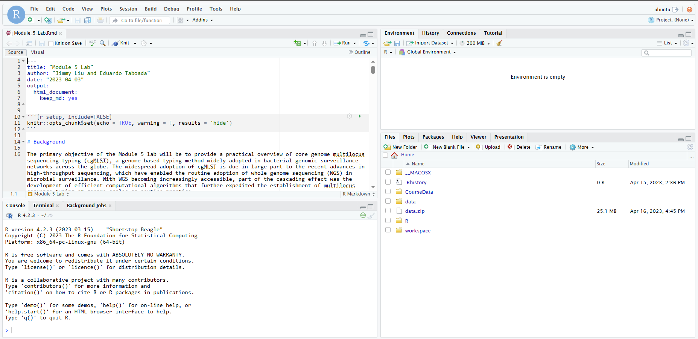

# Module 5 Lab

The lab assignment is written in Rmarkdown (.Rmd) which means that the lab is intended to be run in RStudio IDE.

## Set up

Before connecting to your RStudio instance, please perform the following steps:

1. Log into your remote instance using ssh

```bash
# replace xx with your student number
ssh -i CBW.pem xx.uhn-hpc.ca
```

2. Copy the lab materials from `CourseData` to your home directory

```bash
cp -r  ~/CourseData/IDE_data/module5/ .
```

3. You should now find a directory called `module5` in your home directory. Use `ls` to list the file content in `module5` to verify that you have successfully copied all of the required files.

```bash
ls ./module5
```

Expected output:


## Launching RStudio

1. Open a browser tab and navigate to `http://xx.uhn-hpc.ca:8080` (Remember to replace `xx` with your student number!)

2. Log in using the following credentials:
    - Username: `ubuntu`
    - Password will be provided in class

    If logged in successfully, you should see the following graphical interface in your browser:


3. Load up `Module_5_Lab.Rmd` by clicking [File] -> [Open File] -> [Select the .Rmd file in `module5` directory]

    If you have successfully opened the `.Rmd` file, you will see the following screen:


